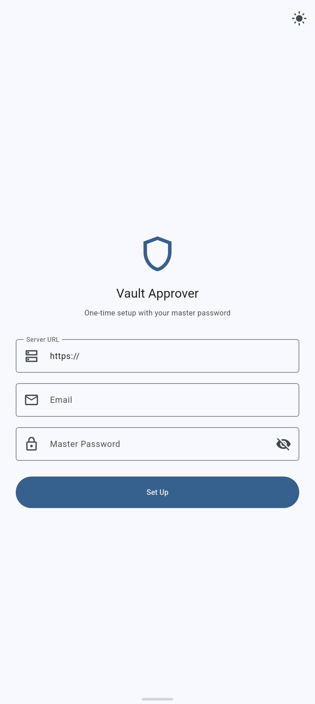
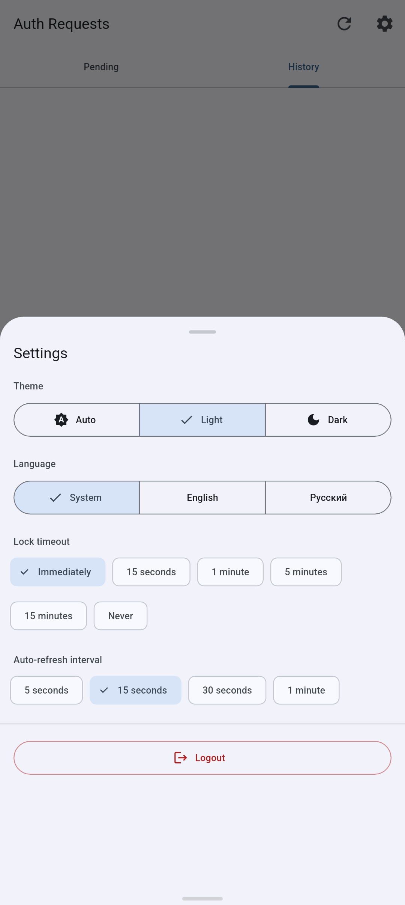
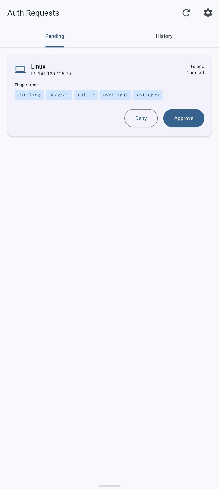
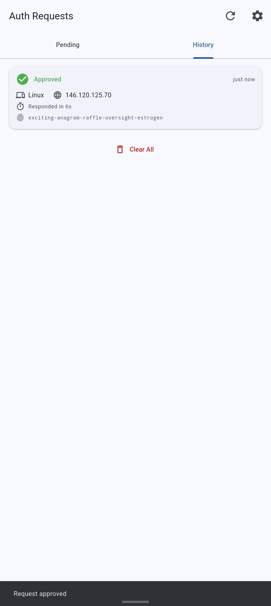

<p align="center">
  
</p>

<h1 align="center">Vault Approver</h1>

<p align="center">
  <strong>EN</strong> &nbsp;|&nbsp; <a href="readme_ru.md">RU</a>
</p>

<p align="center">
  Lightweight mobile app for approving <em>"Login with device"</em> requests<br>
  on a self-hosted <a href="https://github.com/dani-garcia/vaultwarden">Vaultwarden</a> server.
</p>

<p align="center">
  <a href="https://flutter.dev"></a>
  <a href="https://dart.dev"></a>
  
  <a href="LICENSE"></a>
</p>

---

## Why?

Bitwarden supports passwordless login via "Login with device", but approving those requests requires a **full-featured** client (Bitwarden Mobile / Desktop).

Vault Approver is a **single-purpose** alternative:

```
Open app → Face ID / Touch ID → see pending requests → Approve or Deny → done
```

No vault UI, no stored passwords — just an approver.

## Features

| | Feature | Details |
|---|---|---|
| 🔐 | **Biometric unlock** | Face ID / Touch ID on every launch |
| ⚡ | **Real-time notifications** | SignalR WebSocket + MessagePack; polling fallback |
| 🔑 | **Fingerprint phrase** | 5-word EFF phrase shown before approval |
| 🛡️ | **Full E2E encryption** | Master password never stored; RSA-2048-OAEP key exchange |
| 📲 | **2FA / TOTP** | Supports two-factor auth during initial setup |
| 🌍 | **Localization** | English & Russian, in-app language switcher |
| 🎨 | **Themes** | System / Light / Dark |
| 🔄 | **Auto-refresh** | Configurable polling (15 s – 5 min) |
| ⏱️ | **Lock timeout** | Configurable auto-lock (immediate – 15 min) |

## Screenshots

<p align="center">
  
  &nbsp;&nbsp;
  
  &nbsp;&nbsp;
  
  &nbsp;&nbsp;
  
</p>

<p align="center">
  <em>Server login &nbsp;·&nbsp; App setup &nbsp;·&nbsp; Pending request &nbsp;·&nbsp; History</em>
</p>

## Tech Stack

| Layer | Libraries |
|:--|:--|
| Framework | Flutter SDK ≥ 3.5, Dart |
| State management | flutter_riverpod 2.x |
| Crypto | pointycastle 4.x, cryptography 2.x |
| Networking | dio 5.x, web_socket_channel 3.x, msgpack_dart 1.x |
| Platform | local_auth 2.x, flutter_secure_storage 9.x, uuid 4.x |
| L10n | flutter_localizations (SDK), intl |

## Getting Started

### Prerequisites

- Flutter SDK ≥ 3.5.0
- Xcode 15+ (for iOS)
- Android Studio / Android SDK (for Android)

### Run

```bash
flutter pub get
flutter run
```

### Build

```bash
# iOS
flutter build ios --release --no-codesign
# → build/ios/iphoneos/VaultApprover.app

# Android APK
flutter build apk --release

# Android AAB (for Google Play)
flutter build appbundle --release
```

> **Note:** The iOS Xcode target is named **VaultApprover** (`ios/VaultApprover.xcodeproj`), but the scheme is kept as `Runner` for Flutter tooling compatibility.

## Project Structure

```
lib/
├── main.dart                         # Entry point
├── app.dart                          # MaterialApp, providers (theme, locale, timeout)
│
├── l10n/
│   ├── app_en.arb                    # English strings (template)
│   └── app_ru.arb                    # Russian strings
│
├── models/
│   ├── auth_request.dart             # AuthRequest model
│   ├── cipher_string.dart            # CipherString parser & HMAC verifier
│   ├── encryption_type.dart          # EncType enum
│   ├── kdf_params.dart               # KDF parameters (Argon2id / PBKDF2)
│   └── user_session.dart             # Session state (server URL, tokens, keys)
│
├── providers/
│   ├── auth_requests_provider.dart   # Pending & history request providers
│   ├── service_providers.dart        # DI providers for services
│   └── session_provider.dart         # Session state provider
│
├── screens/
│   ├── setup_screen.dart             # First-time setup (URL, email, password, 2FA)
│   └── requests_screen.dart          # Main screen: request list, history, settings
│
├── services/
│   ├── vault_api.dart                # REST API client (Vaultwarden / Bitwarden API)
│   ├── crypto_service.dart           # Full Bitwarden-compatible crypto chain
│   ├── notification_service.dart     # SignalR WebSocket + polling fallback
│   ├── biometric_service.dart        # Face ID / Touch ID wrapper
│   └── secure_storage_service.dart   # Keychain / Keystore wrapper
│
├── utils/
│   ├── constants.dart                # App constants
│   ├── eff_wordlist.dart             # EFF long wordlist (7 776 words)
│   └── wordlist.dart                 # Wordlist loader
│
└── widgets/
    ├── auth_request_card.dart        # Request card UI
    └── fingerprint_phrase.dart       # Fingerprint phrase widget
```

## Security Model

| Aspect | Implementation |
|:--|:--|
| Key storage | UserKey in Keychain (iOS) / Keystore (Android), protected by biometrics |
| E2E | Server never sees encryption keys |
| Master password | Entered **once** during setup, never stored |
| Request verification | Fingerprint phrase displayed before approval |
| Biometric change | Key invalidated → re-setup required |
| Server compromise | Does not reveal UserKey |

## Crypto Chain

<details>
<summary><strong>First-time setup</strong></summary>

```
1. POST /api/accounts/prelogin { email }
   → { kdf: 1 (Argon2id), kdfIterations, kdfMemory, kdfParallelism }

2. Argon2id(password, salt=email, params)
   → masterKey (32 bytes)

3. HKDF-Expand-SHA256(masterKey, info="enc", 32) → stretchedEncKey
   HKDF-Expand-SHA256(masterKey, info="mac", 32) → stretchedMacKey

4. PBKDF2-SHA256(masterKey, password, 1 iteration) → masterPasswordHash

5. POST /identity/connect/token {
     grant_type: "password", username: email,
     password: masterPasswordHash, client_id: "mobile",
     scope: "api offline_access",
     deviceType: 0|1, deviceIdentifier: uuid,
     deviceName: "VaultApprover"
   }
   → { access_token, refresh_token, Key (protectedSymmetricKey), … }

6. CipherString.parse(Key)          # "2.{iv}|{ct}|{mac}"
   → HMAC-SHA256 verify → AES-256-CBC decrypt
   → userKey (64 bytes = 32 enc + 32 mac)

7. Random biometricStorageKey (32 bytes)
   → AES-256-CBC encrypt(userKey) → store in Keychain/Keystore
   → Store refresh_token in secure storage
```

</details>

<details>
<summary><strong>Approving a request</strong></summary>

```
1. Biometric unlock → decrypt userKey from storage

2. GET /api/auth-requests (Bearer token)
   → [{ id, publicKey, requestDeviceType, requestIpAddress, creationDate }]

3. Fingerprint phrase:
   SHA256(publicKey) → HKDF-Expand(info=email) → 5 EFF words

4. Approve:
   RSA-2048-OAEP-SHA1(userKey, publicKey) → "4.{base64}"
   PUT /api/auth-requests/{id} { key, requestApproved: true }

5. Deny:
   PUT /api/auth-requests/{id} { key: null, requestApproved: false }
```

</details>

<details>
<summary><strong>WebSocket notifications (SignalR + MessagePack)</strong></summary>

```
1. Connect: ws(s)://server/notifications/hub?access_token=JWT
2. Handshake: {"protocol":"messagepack","version":1}\x1e → {}\x1e
3. Messages: [1, {}, null, "ReceiveMessage", [{ Type: 15, Payload: {Id, UserId} }]]
4. Keepalive: ping (type 6) every 30 s
5. Fallback: polling GET /api/auth-requests
```

</details>

## API Notes

- Auth requests expire after **15 minutes** (server purge job)
- Token endpoint: `POST /identity/connect/token` (`application/x-www-form-urlencoded`)
- Refresh: `grant_type=refresh_token&refresh_token=…&client_id=mobile`
- Device registration is automatic on first login
- `client_id: "mobile"` is required

## Localization

Strings live in `lib/l10n/` as ARB files:

| File | Language |
|:--|:--|
| `app_en.arb` | English (template) |
| `app_ru.arb` | Russian |

Generated code is created automatically (`generate: true` in `pubspec.yaml`).

To add a locale: create `app_XX.arb` → add to `supportedLocales` in `lib/app.dart`.

Users can switch language in-app: **Settings → Language** (System / English / Русский).

## License

MIT

## References

**Documentation:**
- [Bitwarden Security Whitepaper](https://bitwarden.com/help/bitwarden-security-white-paper/)
- [Bitwarden Authentication Deep-Dive](https://contributing.bitwarden.com/architecture/deep-dives/authentication/)
- [Bitwarden KDF Algorithms](https://bitwarden.com/help/kdf-algorithms/)
- [Bitwarden Fingerprint Phrase](https://bitwarden.com/help/fingerprint-phrase/)

**Source code:**
- [dani-garcia/vaultwarden](https://github.com/dani-garcia/vaultwarden) — server
- [bitwarden/clients](https://github.com/bitwarden/clients) — official clients

**Key dependencies:**
- [flutter_riverpod](https://pub.dev/packages/flutter_riverpod) — state management
- [pointycastle](https://pub.dev/packages/pointycastle) — AES, RSA, HMAC, PBKDF2
- [cryptography](https://pub.dev/packages/cryptography) — Argon2id, HKDF
- [dio](https://pub.dev/packages/dio) — HTTP client
- [web_socket_channel](https://pub.dev/packages/web_socket_channel) — WebSocket
- [local_auth](https://pub.dev/packages/local_auth) — biometric authentication
- [flutter_secure_storage](https://pub.dev/packages/flutter_secure_storage) — Keychain / Keystore
